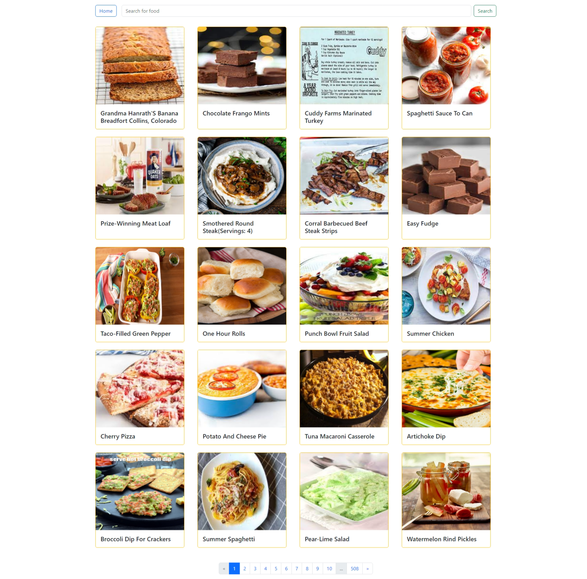
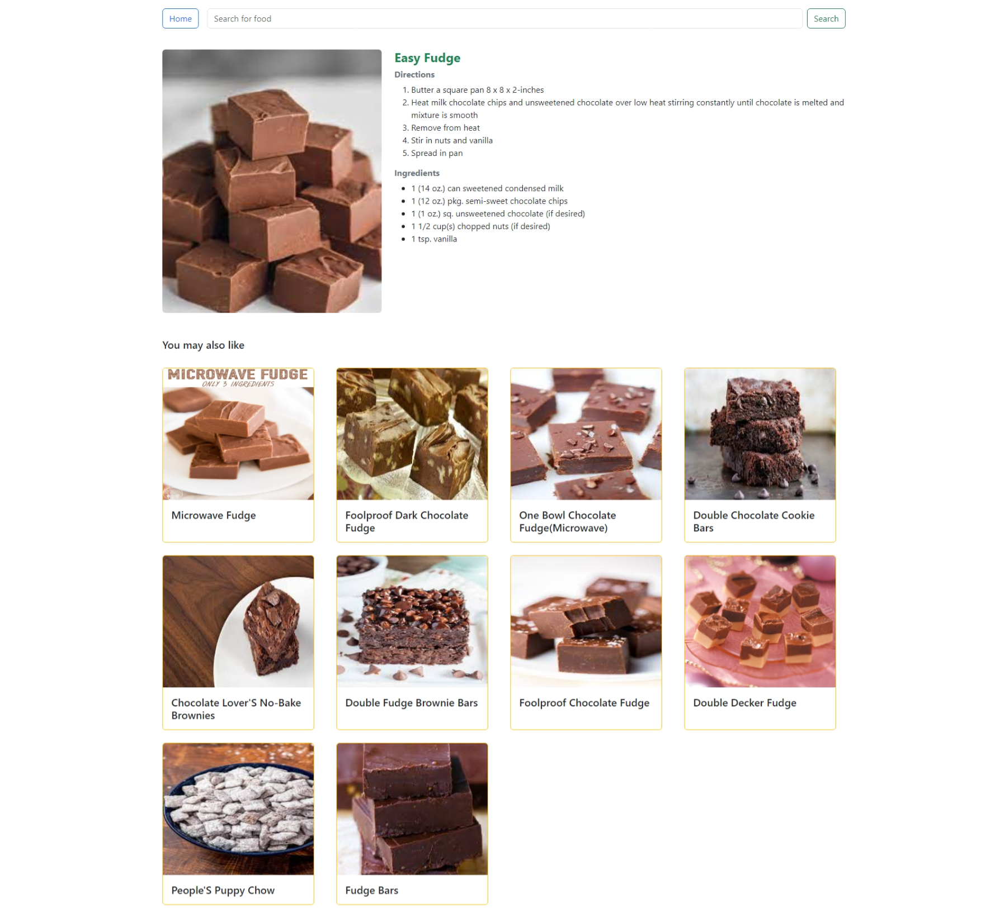
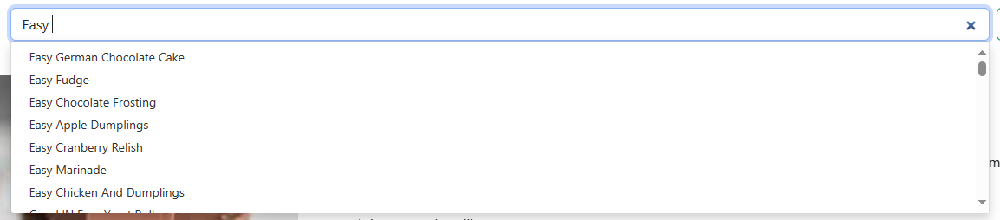

<h1 align="center">Food Recommendation System</h1>
<p align="center">
    
    
    
</p>

Welcome to the Food Recommendation System repository! This project is dedicated to creating an intelligent system that suggests delicious food options based on various factors. Whether you're a foodie looking for your next meal inspiration or a developer interested in recommendation algorithms, this project has something for you.

<hr>

- [📄  Features](#--features)
- [📚 Demo](#-demo)
    - [Home Page](#home-page)
    - [Recommendation Page](#recommendation-page)
    - [Autocomplete](#autocomplete)
- [⛳ Getting Started](#-getting-started)
  - [Prerequisites](#prerequisites)
  - [Usage](#usage)
- [💻 Code Contributors](#-code-contributors)
- [👤 Author](#-author)
- [📃 License](#-license)

## 📄  Features

Our Food Recommendation System offers a wide range of features to enhance your culinary experience:

- **Accurate Recommendations:** Get food recommendations based upon the food you are interested in.
- **Easy-to-Use Interface:** Intuitive design for effortless navigation.

## 📚 Demo

#### Home Page
[]()

#### Recommendation Page


#### Autocomplete


## ⛳ Getting Started

To get started with the Food Recommendation System on your local machine, follow these steps:

### Prerequisites

- Python 3.7+
- pip package manager
- Virtual environment (optional but recommended)

### Usage 

1. Clone this repository:

   ```bash
   git clone https://github.com/VVB2/Food_Recommendation.git
   ```

2. Navigate to the project directory:

   ```bash
   cd Food_Recommendation
   ```

3. Install the required dependencies:

   ```bash
   pip install -r requirements.txt
   ```

4. Run the application:

   ```bash
   python server.py
   ```

5. Access the Food Recommendation System in your web browser at `http://localhost:5000`.

## 💻 Code Contributors

<a href="https://github.com/VVB2/Food_Recommendation/graphs/contributors">
  
</a>

## 👤 Author
🙃 Vinod Vaman Bhat
- GitHub: [@VVB2](https://github.com/VVB2)
- Portfolio Website: [@VVB](https://snazzy-tartufo-6f8f42.netlify.app/)

## 📃 License

Copyright © 2022 [Vinod Vaman Bhat](https://github.com/VVB2). <br>
This project is [MIT](https://github.com/kefranabg/readme-md-generator/blob/master/LICENSE) licensed.